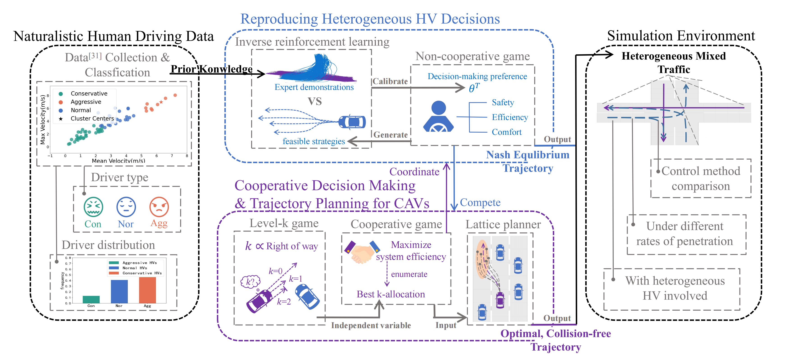

# Cooperative Driving of Connected Autonomous Vehicles in Heterogeneous Mixed Traffic: A Game Theoretic Approach

**[Shiyu Fang](https://tops.tongji.edu.cn/info/1033/1190.htm)**, [Peng Hang](https://tops.tongji.edu.cn/info/1031/1383.htm), [Jian Sun](https://tops.tongji.edu.cn/info/1031/1187.htm)  

[Department of Traffic Engineering and Key Laboratory of Road and Traffic Engineering, Ministry of Education, Tongji University](https://tops.tongji.edu.cn/)  

## Abstract

High-density, un-signalized intersection has always been a bottleneck of efficiency and safety. The emergence of Connected Autonomous Vehicles (CAVs) results in a mixed traffic condition, further increasing the complexity of the transportation system. Against this background, this paper aims to study the intricate and heterogeneous interaction of vehicles and conflict resolution at the high-density, mixed, un-signalized intersection. Theoretical insights about the interaction between CAVs and Human-driven Vehicles (HVs) and the cooperation of CAVs are synthesized, based on which a novel cooperative decision-making framework in heterogeneous mixed traffic is proposed. Normalized Cooperative game is concatenated with Level-k game (NCL game) to generate a system optimal solution. Then Lattice planner generates the optimal and collision-free trajectories for CAVs. To reproduce HVs in mixed traffic, interactions from naturalistic human driving data are extracted as prior knowledge. Non-cooperative game and Inverse Reinforcement Learning (IRL) are integrated to mimic the decision making of heterogeneous HVs. Finally, three cases are conducted to verify the performance of the proposed algorithm, including the comparative analysis with different methods, the case study under different Rates of Penetration (ROP) and the interaction analysis with heterogeneous HVs. It is found that the proposed cooperative decision-making framework is beneficial to the driving conflict resolution and the traffic efficiency improvement of the mixed un-signalized intersection. Besides, due to the consideration of driving heterogeneity, better human-machine interaction and cooperation can be realized in this paper. 

## Method Overview

### REPRODUCING HETEROGENEOUS HV 
To achieve the above purpose, an elaborate framework is proposed. Firstly, naturalistic human driving data are collected and analyzed for investigating the driver decision type and its distribution from a real-world intersection. Besides, it has to be noted that modeling heterogeneous drivers mammoth project. Given that this paper is primarily concerned with establishing a cooperative driving framework for CAV, we turn to reproduce the heterogeneous decision for simplification. Then a series of feasible trajectories are generated through non-cooperative game and compare them with expert demonstrations from naturalistic human driving data. Through maximum entropy IRL, different decision-making preferences are calibrated. We then reproduce the decision of heterogeneous HVs with Nash Equilibrium solution and generate the corresponding next state through vehicle dynamics. 

To verify whether the combination of the non-cooperative game and IRL can effectively reproduce the behavior of the human driver, we adopt the replay test method. Specifically, the subject vehicle utilizes a game theory framework consisting of six discrete strategies for decision-making, while the interactive vehicles replays extracted trajectories accordingly. 

Firstly, we conducted a comparison to assess the consistency between the reproduced sequence of passages and the actual sequence. The results reveal that 89% of cases reproduced the same sequence of passages as observed in reality. In contrast to employing IDM as the HV decision model, it exhibits 45% improvement. The primary reason for IDM's poor performance is that IDM is commonly employed as a car-following model, depicting the relationship between the following vehicle and the leading vehicle. Therefore, it is difficult to describe the interdependence of actions during the interaction process. The above results demonstrate that the proposed method outperforms IDM in reproducing HV decisions, thereby facilitating the establishment of a more realistic simulation environment for examining our CAV algorithm.

Secondly, we visualize the reproduced HV trajectories and the actual trajectories, as shown in Figure below. The Result shows that the reproduced trajectories highly coincide with the actual trajectories. To further compare the similarity of the trajectories between reproduced HV trajectories and the actual trajectories, we employ Dynamic Time Warping (DTW) which minimizes the effects of shifting and distortion in time through a flexible transformation/mapping of time.


### COOPERATIVE DECISION MAKING AND TRAJECTORY PLANNING FOR CAVS
In addition, for the cooperative decision making and trajectory planning of CAVs, the three-layer hierarchy that most autonomous robot controls are using to generate the safe and continuous state is adopted. At the top of the hierarchy, level-k game is introduced to imitate the human reasoning depths and also served as a next-layer's independent variable. Then, based on cooperative game, k-allocation which leads to system optimum can be achieved by enumerating. At the bottom layer, Lattice planner will generate an optimal and collision-free trajectory that conforms to the vehicle's dynamic constraints.



## Citation
```
@misc{fang2023cooperative,
      title={Cooperative Driving of Connected Autonomous Vehicles in Heterogeneous Mixed Traffic: A Game Theoretic Approach}, 
      author={Shiyu Fang and Peng Hang and Chongfeng Wei and Yang Xing and Jian Sun},
      year={2023},
      eprint={2305.03563},
      archivePrefix={arXiv},
      primaryClass={cs.MA}
}
```

## Contact

If you have any questions, feel free to contact us (2111219@tongji.edu.cn).
